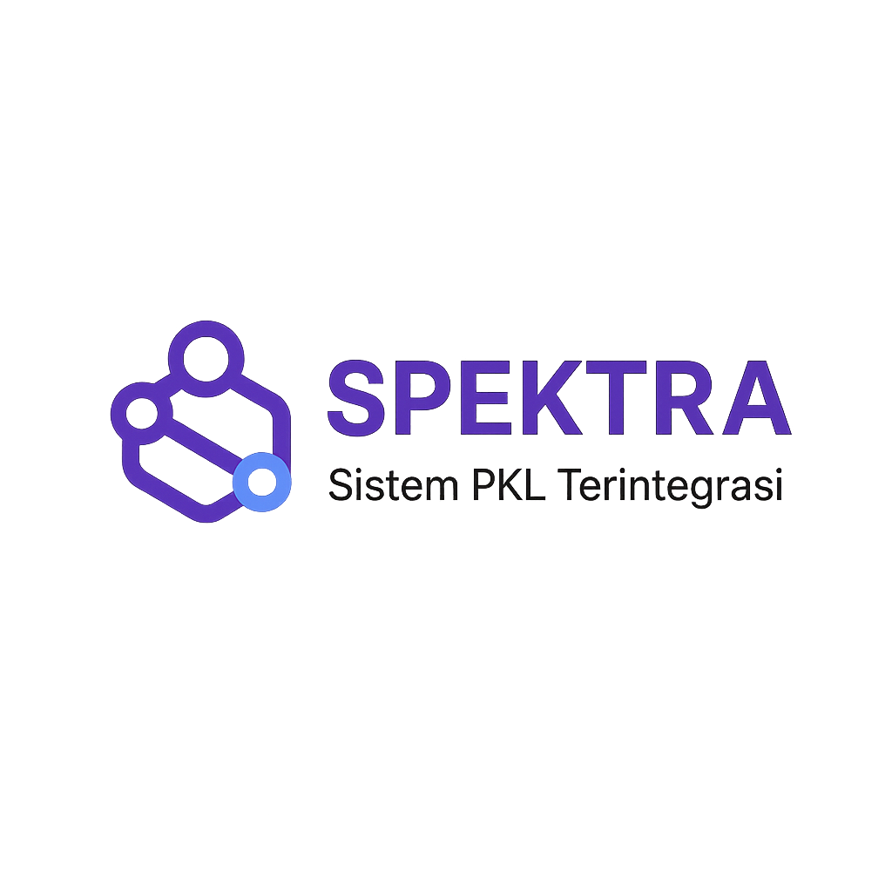

<!-- PROJECT LOGO -->
<div align="center">
  <h1>
    <br>
    
    <br>
    SPEKTRA
    <br>
  </h1>
  <h3>Sistem Pengelolaan Kerja Praktik Terintegrasi Akademia</h3>
  
  [![Laravel][Laravel-badge]][Laravel-url]
  [![PHP][PHP-badge]][PHP-url]
  [![MySQL][MySQL-badge]][MySQL-url]
  [![Bootstrap][Bootstrap-badge]][Bootstrap-url]
  [![AlpineJS][AlpineJS-badge]][AlpineJS-url]
  [![License: MIT][License-badge]][License-url]
  
  <p align="center">
    Platform terintegrasi untuk manajemen kerja praktik/magang yang menghubungkan mahasiswa, dosen pembimbing, koordinator, dan pembimbing lapangan
    <br />
    <a href="#tentang-spektra"><strong>Pelajari lebih lanjut »</strong></a>
    <br />
    <br />
    <a href="#demo">Lihat Demo</a>
    ·
    <a href="https://github.com/Rimaestro/spektra-internship/issues">Laporkan Bug</a>
    ·
    <a href="https://github.com/Rimaestro/spektra-internship/issues">Request Fitur</a>
  </p>
</div>

<!-- TABLE OF CONTENTS -->
## Daftar Isi

- [Daftar Isi](#daftar-isi)
- [Tentang SPEKTRA](#tentang-spektra)
- [Dibangun Dengan](#dibangun-dengan)
- [Fitur Utama](#fitur-utama)
- [Memulai](#memulai)
  - [Prasyarat](#prasyarat)
  - [Instalasi](#instalasi)
- [Penggunaan](#penggunaan)
- [Roadmap](#roadmap)
- [Kontribusi](#kontribusi)
- [Lisensi](#lisensi)
- [Kontak](#kontak)
- [Acknowledgments](#acknowledgments)

<!-- ABOUT THE PROJECT -->
## Tentang SPEKTRA

<div align="center">
  
</div>
<br>

SPEKTRA (Sistem Pengelolaan Kerja Praktik Terintegrasi Akademia) adalah sistem informasi berbasis web untuk manajemen Praktek Kerja Lapangan (PKL) yang menghubungkan semua stakeholder dalam satu platform terintegrasi.

Proyek ini dikembangkan untuk:
* Menyederhanakan proses administrasi PKL dari pendaftaran hingga penilaian
* Memudahkan monitoring dan evaluasi kegiatan mahasiswa selama PKL
* Menyediakan dashboard analitik untuk pengambilan keputusan
* Menciptakan repositori laporan PKL yang terstruktur dan mudah diakses

## Dibangun Dengan

SPEKTRA dibangun menggunakan teknologi modern untuk pengembangan web:

* [![Laravel][Laravel-badge]][Laravel-url]
* [![PHP][PHP-badge]][PHP-url]
* [![MySQL][MySQL-badge]][MySQL-url]
* [![Bootstrap][Bootstrap-badge]][Bootstrap-url]
* [![AlpineJS][AlpineJS-badge]][AlpineJS-url]
* [![Livewire][Livewire-badge]][Livewire-url]

## Fitur Utama

1. **Manajemen User Multi-Role**
   - Mahasiswa
   - Dosen Pembimbing
   - Koordinator PKL
   - Pembimbing Lapangan
   - Admin Sistem

2. **Manajemen Mitra Perusahaan**
   - Profil perusahaan
   - Kuota dan bidang PKL
   - History penempatan

3. **Pendaftaran & Penempatan**
   - Form pendaftaran online
   - Matching otomatis dengan algoritma rekomendasi
   - Approval workflow

4. **Monitoring & Evaluasi**
   - Laporan aktivitas harian dengan validasi lokasi
   - Dashboard tracking progress
   - Sistem penilaian terintegrasi

5. **Pelaporan & Analitik**
   - Repositori laporan PKL
   - Dashboard statistik dan visualisasi
   - Laporan performa dan evaluasi

## Memulai

Berikut adalah petunjuk untuk menjalankan proyek ini secara lokal.

### Prasyarat

* PHP 8.2 atau lebih tinggi
  ```sh
  php -v
  ```
* Composer
  ```sh
  composer -V
  ```
* MySQL/MariaDB
* Node.js & NPM

### Instalasi

1. Clone repository
   ```sh
   git clone https://github.com/Rimaestro/spektra-internship.git
   ```
2. Masuk ke direktori proyek
   ```sh
   cd spektra-internship
   ```
3. Install dependensi PHP
   ```sh
   composer install
   ```
4. Install dependensi JavaScript
   ```sh
   npm install
   ```
5. Salin file .env.example ke .env
   ```sh
   cp .env.example .env
   ```
6. Generate application key
   ```sh
   php artisan key:generate
   ```
7. Konfigurasi database di file .env
   ```
   DB_CONNECTION=mysql
   DB_HOST=127.0.0.1
   DB_PORT=3306
   DB_DATABASE=spektra
   DB_USERNAME=root
   DB_PASSWORD=
   ```
8. Jalankan migrasi dan seeder
   ```sh
   php artisan migrate --seed
   ```
9. Compile assets
   ```sh
   npm run dev
   ```
10. Jalankan server lokal
    ```sh
    php artisan serve
    ```

## Penggunaan

Setelah instalasi, Anda dapat mengakses aplikasi di `http://localhost:8000`. Berikut adalah beberapa akun default yang dapat digunakan untuk testing:

* **Admin**
  * Email: admin@spektra.ac.id
  * Password: password

* **Mahasiswa**
  * Email: mahasiswa@spektra.ac.id
  * Password: password

* **Dosen Pembimbing**
  * Email: dosen@spektra.ac.id
  * Password: password

* **Koordinator PKL**
  * Email: koordinator@spektra.ac.id
  * Password: password

## Roadmap

- [x] Manajemen user multi-role
- [x] Pendaftaran PKL online
- [x] Monitoring kegiatan harian
- [ ] Integrasi dengan sistem akademik
- [ ] Notifikasi email dan WhatsApp
- [ ] Mobile app untuk laporan harian
- [ ] API untuk integrasi dengan sistem eksternal

Lihat [open issues](https://github.com/Rimaestro/spektra-internship/issues) untuk daftar lengkap fitur yang diusulkan dan bug yang diketahui.

## Kontribusi

Kontribusi membuat komunitas open source menjadi tempat yang luar biasa untuk belajar, menginspirasi, dan berkreasi. Setiap kontribusi yang Anda berikan **sangat dihargai**.

Jika Anda memiliki saran yang akan membuat proyek ini lebih baik, silakan fork repository dan buat pull request. Anda juga dapat membuka issue dengan tag "enhancement".
Jangan lupa untuk memberikan bintang pada proyek! Terima kasih!

1. Fork proyek
2. Buat Feature Branch (`git checkout -b feature/AmazingFeature`)
3. Commit perubahan Anda (`git commit -m 'Add some AmazingFeature'`)
4. Push ke Branch (`git push origin feature/AmazingFeature`)
5. Buka Pull Request

## Lisensi

Didistribusikan di bawah Lisensi MIT. Lihat `LICENSE` untuk informasi lebih lanjut.

## Kontak

Tim Pengembang - [@spektra_dev](https://twitter.com/spektra_dev) - info@spektra.ac.id

Project Link: [https://github.com/Rimaestro/spektra-internship](https://github.com/Rimaestro/spektra-internship)

## Acknowledgments

* [Laravel](https://laravel.com)
* [Bootstrap](https://getbootstrap.com)
* [Font Awesome](https://fontawesome.com)
* [Shields.io](https://shields.io)

<!-- MARKDOWN LINKS & IMAGES -->
[Laravel-badge]: https://img.shields.io/badge/Laravel-FF2D20?style=for-the-badge&logo=laravel&logoColor=white
[Laravel-url]: https://laravel.com
[PHP-badge]: https://img.shields.io/badge/PHP-777BB4?style=for-the-badge&logo=php&logoColor=white
[PHP-url]: https://www.php.net
[MySQL-badge]: https://img.shields.io/badge/MySQL-4479A1?style=for-the-badge&logo=mysql&logoColor=white
[MySQL-url]: https://www.mysql.com
[Bootstrap-badge]: https://img.shields.io/badge/Bootstrap-563D7C?style=for-the-badge&logo=bootstrap&logoColor=white
[Bootstrap-url]: https://getbootstrap.com
[AlpineJS-badge]: https://img.shields.io/badge/AlpineJS-8BC0D0?style=for-the-badge&logo=alpine.js&logoColor=black
[AlpineJS-url]: https://alpinejs.dev
[Livewire-badge]: https://img.shields.io/badge/Livewire-FB70A9?style=for-the-badge&logo=livewire&logoColor=white
[Livewire-url]: https://laravel-livewire.com
[License-badge]: https://img.shields.io/badge/License-MIT-yellow.svg?style=for-the-badge
[License-url]: https://opensource.org/licenses/MIT